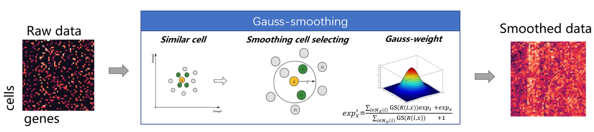

# EAGS:efficient and adaptive Gaussian smoothing
## introduction
EAGS is a smoothing approach for spatial transcriptome data with ultrahigh resolution. 
Through the principal component information of the profiling of gene expression and the 
personally identifiable information between cells, it uses a two-factor adaptive smoothing 
weight mechanism to determine the neighborhood relationship of cells. Then it uses the 
self-developed smoothing weight formula to calculate the smoothing contribution and 
recalculate the gene expression of each cell.
## Shows the process flow of the approach principle

## Smoothing strategy

"EGAS_using.py" is a function which you can just provide an h5ad file path and return you a
h5ad file with smooth(maybe it's not a best choice for you but it's a good start)


## Warning
After smooth your gene expression matrix（adata.X）may not be filled with integer,but filled with Multiple decimal.
That's because Gauaaian_smoothing's principle. So, if you want your matrix filled with integer,
you need to multiply it and Rounding.
## Install
```bash
### enviroment by Conda
conda create -n EGAS python=3.8.12
conda activate EGAS
pip install -r requirements.txt
```
## Parameters

Gaussian function to calculate smooth weight:


| Parameters  |         Recommended         |  description |
|----------|:---------------------------:|------:|
| a |              1              | a in Gaussian function |
| b |              0              | b in Gaussian function |
| c | self adaptively calculation |c in Gaussian function |

——————————————————————————————————————————

| Parameters  |    Recommended       |  description |
|----------|:-------:|------:|
| k |  10 | Choose the number of similar cells to smooth expression |
| n_comps |  50 | Similar cells defined in n_comps PCA dimension |
| input |  | Input file name (Anndata,raw counts) |
| output |  | Output file name (Anndata,smoothed raw counts)|


If the correction effect is insufficient，increase the values of k , decrease c;
